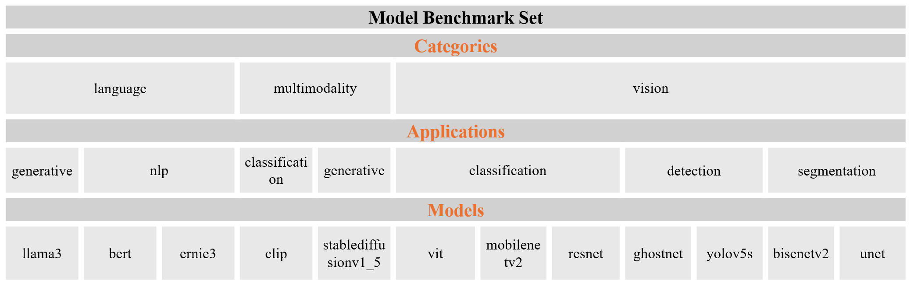
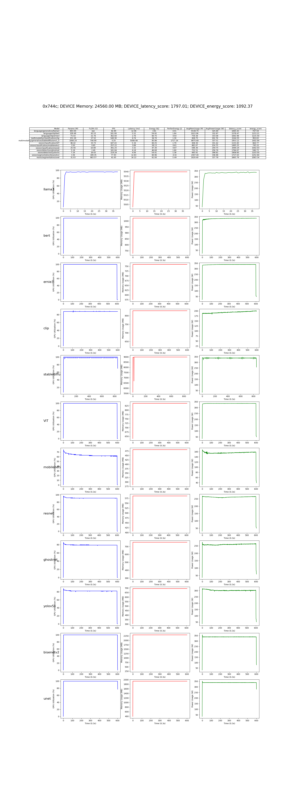

# AI Accelerators Benchmark

[](https://) 
$~~~~$
[](README.zh-CN.md)

Current Version:

1. Performance testing for GPUs (Nvidia, AMD, single card) on CUDA platforms using a collection of classic deep learning models based on PyTorch.
2. Performance testing for SophgoTPU (single card) using a collection of classic deep learning models in bmodel format.
---

In the future, this project will continue to enrich the deep learning model testing repository, expand to more deep learning frameworks, and include more AI accelerator chips. It will also improve the methods for evaluating AI accelerator performance, aiming to provide a more comprehensive and reasonable evaluation system.

<p align="center">
  
</p>

## Contents

- [1. Model Benchmark Set](#1-model-benchmark-set)
- [2. Performance Evaluation Method](#2-performance-evaluation-method)
- [3. Getting Started](#3-getting-started)
- [4. Detailed Explanation](#4-detailed-explanation)
- [5. Sample Test Results](#5-sample-test-results)

## 1. Model Benchmark Set

The collection of deep learning models used to test AI accelerator chips in this project is referred to as the Model Benchmark Set.

In the current version, the Model Benchmark Set includes the following:

<p align="center">
  
</p>

## 2. Performance Evaluation Method

The current version of the AI accelerator performance evaluation methods is as follows:

### 2.1 Benchmark

The NVIDIA GeForce RTX 2080 Ti is used as the baseline platform. All deep learning models in the model test suite and the baseline scores on the baseline platform are set to 1000 points, serving as the reference line for the subsequent evaluation of the accelerator cards.

### 2.2 Performance Evaluation

The same set of models is migrated to the platform under test for iterative inference, collecting two sets of data: 1. Model inference time efficiency; 2. AI accelerator card power consumption.

Subsequently, the relative performance of the platform under test is quantified by comparing it with the known performance of the baseline platform while handling the same tasks.

### 2.3 Scoring Mechanism

This project uses a weighted comprehensive evaluation method. The specific method is as follows:

1. Comparison: The actual performance of each model on the platform under test is compared with the baseline value on the baseline platform to obtain the relative score of the platform under test.

2. Aggregation and Weighted Average: The scores of all models on the platform under test are aggregated and weighted averaged to derive the performance score of the platform under test on the model test suite.

The scoring includes two parts: 1. Model inference time efficiency; 2. AI accelerator card power consumption. The calculation formulas are as follows:

- The scores of the two indicators for model $i$ on the platform under test:

  $ Model\_ i\_ Latency\_ score\_ B~ = ~\frac{Model\_ i\_ Latency\_ A~} {Model\_ i\_ Latency\_ B~} ~ \times 1000 $

  $ Model\_ i\_ Energy\_ score\_ B~ = ~\frac{Model\_ i\_ Energy\_ A~} {Model\_ i\_ Energy\_ B~} ~ \times 1000 $

- The overall evaluation score of the platform under test:

  $ Latency\_ score\_ B~ = ~AVG（Model\_ i\_ Latency\_ score\_ B）$

  $ Energy\_ score\_ B~ = ~AVG（Model\_ i\_ Energy\_ score\_ B）$

Where:

  $ Model\_ i\_ Latency $ represents the Latency indicator value of model $i$ on the computing platform, i.e., the time it takes for model $i$ to complete one inference on the computing platform.

  $ Model\_ i\_ Energy $ represents the Energy indicator value of model $i$ on the computing platform, i.e., the power consumption required for model $i$ to complete one inference on the computing platform.

  $ Model\_ i\_ Latency\_ score\_ B $ represents the Latency score of model $i$ on the platform under test, which is used to evaluate model inference time efficiency.

  $ Model\_ i\_ Energy\_ score\_ B $ represents the Energy score of model $i$ on the platform under test, which is used to evaluate AI accelerator card power consumption.


## 3. Getting Started
### 3.1 Environment Setup
    pip install -r requirements.txt

### 3.2 Project Dependency Files

- PyTorch model weights for GPU testing:
[PyTorch Model Weights (Google Drive)](https://drive.google.com/drive/folders/19DTAlo4n9vDt7KwcKORR9GqDf4z8USKa?usp=sharing)

- BModel files for SophgoTPU testing:
[BModel Files (Google Drive)](https://drive.google.com/drive/folders/1bDDZYDz3ctvvUYixU-VAm37Sowwm6aCw?usp=sharing)

- Ensure that the paths for the PyTorch model weights are formatted as follows. Vision models in the project do not use weights for now:

  ```
  Benchmark
  ├── model
  │   └── pytorch
  │       ├── language
  │       │   ├── generative
  │       │   │   └── llama3
  │       │   │       └── ggml-meta-llama-3-8b-Q4_K_M.gguf
  │       │   └── nlp
  │       │       ├── bert
  │       │       │   └── vocab
  │       │       │       └── pytorch_model.bin
  │       │       └── ernie3
  │       │           └── vocab
  │       │               └──pytorch_model.bin
  │       ├── multimodality
  │       │   ├── classification
  │       │   │   └── clip
  │       │   │       └── ViT-B-32.pt
  │       │   └── generative
  │       │       └── stablediffusionv1_5
  │       │           └── models--runwayml--stable-diffusion-v1-5
  ...
  ```

- Ensure that the paths for the bmodel files are formatted as follows:

  ```
  Benchmark
  ├── model
  │   ├── bmodel
  │   │   ├── language
  │   │   │   ├── generative
  │   │   │   │   └── llama3
  │   │   │   │       └── llama3-8b_int4_1dev_seq512.bmodel
  │   │   │   └── nlp
  │   │   │       ├── bert
  │   │   │       │   ├── bert4torchf16.bmodel
  │   │   │       │   └── bert4torchf32.bmodel
  │   │   │       └── ernie3
  │   │   │           ├── ernie3_1684x_f16.bmodel
  │   │   │           └── ernie3_1684x_f32.bmodel
  │   │   ├── multimodality
  │   │   │   ├── classification
  │   │   │   │   └── clip
  │   │   │   │       ├── clip_image_vitb32_bm1684x_f16.bmodel
  │   │   │   │       ├── clip_image_vitb32_f32.bmodel
  │   │   │   │       ├── clip_text_vitb32_bm1684x_f16.bmodel
  │   │   │   │       └── clip_text_vitb32_f32.bmodel
  │   │   │   ├── detection
  │   │   │   └── generative
  │   │   │       └── stablediffusionv1_5
  │   │   │           └── singlize
  │   │   │               ├── text_encoder_1684x_f32.bmodel
  │   │   │               ├── unet_1684x_f16.bmodel
  │   │   │               ├── vae_decoder_1684x_f16.bmodel
  │   │   │               └── vae_encoder_1684x_f16.bmodel
  │   │   └── vision
  │   │       ├── classification
  │   │       │   ├── mobilenetv2
  │   │       │   │   ├── mobilenetv2_1684x_f16.bmodel
  │   │       │   │   └── mobilenetv2_1684x_f32.bmodel
  │   │       │   ├── resnet
  │   │       │   │   ├── resnet_1684x_f16.bmodel
  │   │       │   │   └── resnet_1684x_f32.bmodel
  │   │       │   └── ViT
  │   │       │       ├── vit_1684x_f16.bmodel
  │   │       │       └── vit_1684x_f32.bmodel
  │   │       ├── detection
  │   │       │   ├── ghostnet
  │   │       │   │   ├── ghostnet_1684x_f16.bmodel
  │   │       │   │   └── ghostnet_1684x_f32.bmodel
  │   │       │   └── yolov5s
  │   │       │       ├── yolov5s_1684x_f16.bmodel
  │   │       │       └── yolov5s_1684x_f32.bmodel
  │   │       └── segmentation
  │   │           ├── bisenetv2
  │   │           │   ├── bisenetv2_1684x_f16.bmodel
  │   │           │   └── bisenetv2_1684x_f32.bmodel
  │   │           └── unet
  │   │               ├── unet_1684x_f16.bmodel
  │   │               └── unet_1684x_f32.bmodel
  ...
  ```

### 3.3 Project Startup
- Test all models in the Model Benchmark Set repository at once:

      python main.py --testmode 0

- Test a single model from the Model Benchmark Set repository:

      python main.py --testmode 1

### 3.4 Test Results
Upon completion of the tests, the results will be saved in the "savefiles_iter**" folder.

The test results will display the AI accelerator's score on the current device as well as the scores and detailed parameters of each model. Additionally, to ensure that the AI accelerator was operating effectively during the tests, the results will visually present the AI accelerator's performance metrics throughout the testing period.


## 4. Detailed Explanation

- Model Inference Details

  The inference methods for different types of models vary slightly. Input size is crucial to model inference efficiency and significantly impacts the power consumption performance of AI accelerator cards.

  1. Details of Model Inference in the Vision Category

      In this category, all models are inferred using fixed-size random images in a loop. Speed is measured by the number of inferences per second.

      The input sizes for different models in this category are as follows:
      ```
      "yolov5s": (1, 3, 640, 640),
      "ghostnet": (1, 3, 640, 640),
      "unet": (1, 3, 640, 640),
      "resnet": (1, 3, 256, 256),
      "mobilenetv2": (1, 3, 256, 256),
      "bisenetv2": (1, 3, 1024, 2048)
      "ViT": (1, 3, 224, 224)
      ```

  2. Details of Model Inference in the Language Category

      The inference method for llama3 involves querying the model sequentially using the questions from the 'inference/questions_list.csv' file. Speed is measured by the number of tokens generated per second.

      The inference method for bert and ernie3 involves looping with the same input row, with an input length of 256. Speed is measured by the number of inferences per second.

  3. Details of Model Inference in the Multimodality Category

      The inference method for clip involves looping with an image of size (1, 3, 224, 224) and a phrase of size (3, 77). Speed is measured by the number of inferences per second.

      The inference method for stablediffusionv1_5 involves using a fixed sentence. Speed is measured by the number of inferences per second.

- BModel Precision

  The choice of BModel precision is crucial to model inference efficiency and also impacts the power consumption performance of AI accelerator cards.

  To ensure fair evaluation and comparison, the precision for llama3 and stablediffusionv1_5 in this project is consistent with the model precision used for inference on the GPU.

  It is recommended to use 32-bit floating-point BModel for the remaining models, with 16-bit floating-point BModel provided as an option.

## 5. Sample Test Results

Tests have been completed for NVIDIA GeForce GTX 1080 Ti, NVIDIA GeForce RTX 2080 Ti, NVIDIA GeForce RTX 4080 SUPER, AMD Radeon RX 6700, and SophgoTPU in the current version. The test command is as follows:

    python main.py --testmode 0 --iterations 5000 --device_monitor_interval 0.3 --bmodel_precision 32
  
The test results are as follows:

<p align="center">
  
</p>

<p align="center">
  
</p>

<p align="center">
  
</p>

<p align="center">
  
</p>

<p align="center">
  
</p>

<p align="center">
  
</p>
