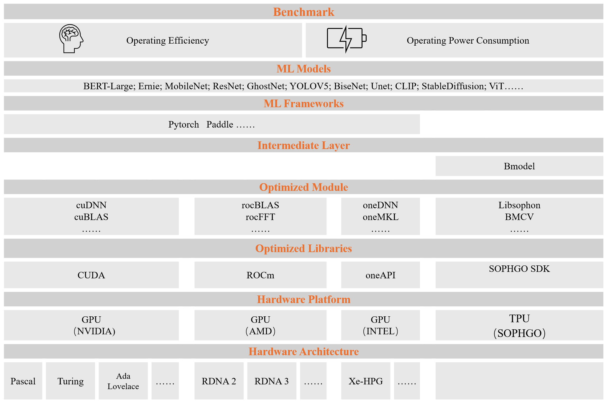
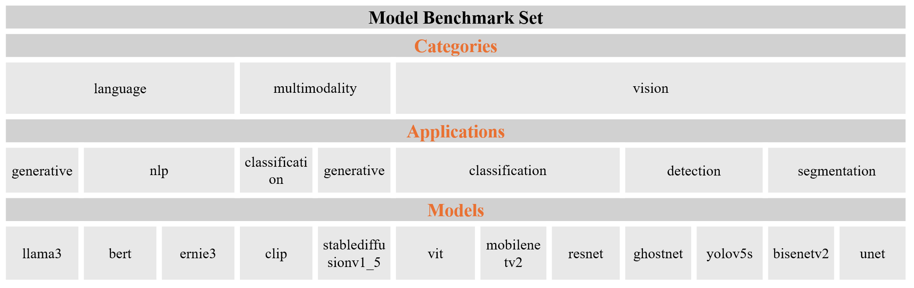
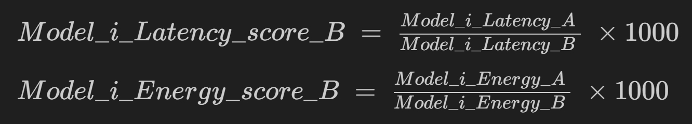
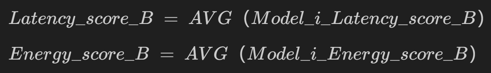
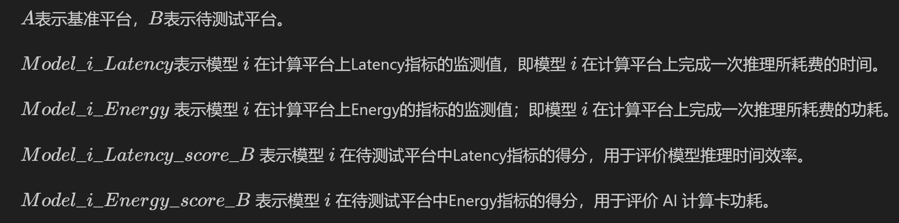
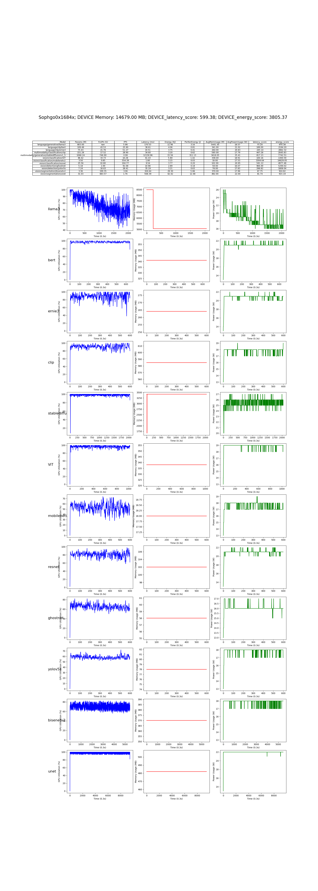
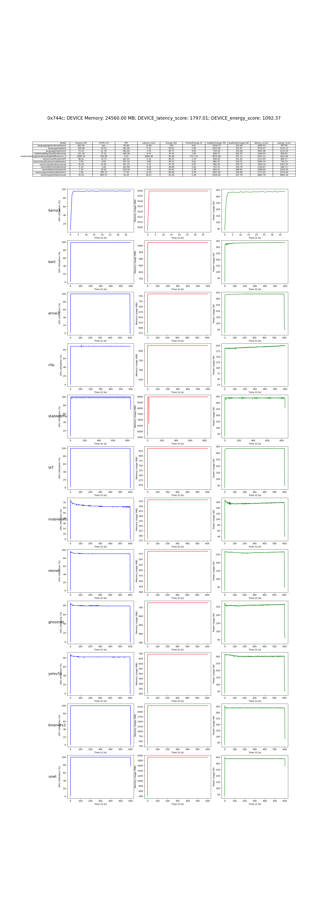

# AI Accelerators Benchmark

[](https://) 
$~~~~$
[](README.md)

当前版本：

1. 使用基于Pytorch的各领域经典深度学习模型集合对CUDA平台所依赖的GPU (Nvidia、AMD, 单卡) 进行性能测试。
2. 使用各领域经典深度学习模型的bmodel集合对SophgoTPU（单卡）进行性能测试。
---

未来，本项目将不断丰富深度学习模型测试仓库，扩展更多深度学习框架以及更多AI加速芯片，改进更合理的AI加速卡的性能评估方法。提供更加合理全面的测评体系。

<p align="center">
  
</p>

## 目录

- [1. 模型测试集](#1-模型测试集)
- [2. 性能评估方法](#2-性能评估方法)
- [3. 开始使用](#3-开始使用)
- [4. 细节说明](#4-细节说明)
- [5. 测试结果示例](#5-测试结果示例)

## 1. 模型测试集

本项目将用于测试AI加速芯片的深度学习模型集合称为模型测试集。

当前版本，模型测试集如下：

<p align="center">
  
</p>

## 2. 性能评估方法

当前版本，AI 加速卡性能评估方法如下：

### 2.1 测试基准

以 NVIDIA GeForce RTX 2080 Ti 作为基准平台。基准平台上所有模型测试集的深度学习模型以及基准平台自身的基准分设定为 1000 分，以此作为后续计算卡评估的基准线。

### 2.2 性能评估

将同一系列模型迁移至待测试平台上执行循环推理，并收集两部分数据：  1. 模型推理时间效率; 2. AI 计算卡功耗. 

之后，通过对比基准平台已知性能，量化待测试平台在处理相同任务时的相对性能。

### 2.3 评分机制

本项目采用加权综合评价法。具体方法如下：

1. 对比：将待测试平台上各模型的实际表现与基准平台的基准值进行比较, 得到待测试平台的相对得分。

2. 汇总与加权平均：对所有模型在待测试平台的得分进行汇总与加权平均，得出待测试平台在模型测试集上的表现评分。

评分包括两个部分： 1. 模型推理时间效率; 2. AI 计算卡功耗. 计算公式如下：

- 模型 $i$ 在待测试平台上两个指标的得分：



- 待测试平台评估得分：




式中：




## 3. 开始使用
### 3.1 环境配置
    pip install -r requirements.txt

### 3.2 项目依赖文件

- 用于GPU测试的PyTorch模型权重：
[PyTorch模型权重（drive.google）](https://drive.google.com/drive/folders/19DTAlo4n9vDt7KwcKORR9GqDf4z8USKa?usp=sharing)

  此外：

  -  ViT的权重文件： 
    [ViT-B-32.pt](https://openaipublic.azureedge.net/clip/models/40d365715913c9da98579312b702a82c18be219cc2a73407c4526f58eba950af/ViT-B-32.pt)

  - stablediffusionv1_5的权重文件：
      ``` bash
      python3 -c 'from diffusers import StableDiffusionPipeline; model_id = "runwayml/stable-diffusion-v1-5"; pipe = StableDiffusionPipeline.from_pretrained(model_id)'
      ```

- 用于SophgoTPU测试的BModel文件：
[BModel文件（drive.google）](https://drive.google.com/drive/folders/1bDDZYDz3ctvvUYixU-VAm37Sowwm6aCw?usp=sharing)

  - llama3 的Bmodel下载地址：   

    ```bash
    python3 -m dfss --url=open@sophgo.com:/ext_model_information/LLM/LLM-TPU/llama3-8b_int4_1dev_seq512.bmodel
    ```

  - stablediffusionv1_5 的Bmodel下载地址：

    ``` bash
    python3 -m dfss --url=open@sophgo.com:/sophon-demo/Stable_diffusion_v1_5/singlize_bmodels.zip
    ```

- 其他依赖文件：

  - 用于llama3 TPU推理的依赖文件编译详见 `model/model_set/models/language/generative/llama3/utils/README.md`

- 请确保PyTorch模型依赖文件路径符合如下格式：
  ```
  Benchmark
  ├── model
  │   └── model_set
  │       └── pytorch
  │           ├── language
  │           │   ├── generative
  │           │   │   └── llama3
  │           │   │       └── ggml-meta-llama-3-8b-Q4_K_M.gguf
  │           │   └── nlp
  │           │       ├── bert
  │           │       │   └── vocab
  │           │       │       └── pytorch_model.bin
  │           │       └── ernie3
  │           │           └── vocab
  │           │               └──pytorch_model.bin
  │           ├── multimodality
  │           │   ├── classification
  │           │   │   └── clip
  │           │   │       └── ViT-B-32.pt
  │           │   └── generative
  │           │       └── stablediffusionv1_5
  │           │           └── models--runwayml--stable-diffusion-v1-5
  ...
  ```
  其中, 项目中vison类别下的pytorch模型暂无依赖文件，`models--runwayml--stable-diffusion-v1-5`应解压至对应路径。

- 请确保bmodel文件路径符合如下格式：
  ```
  Benchmark
  ├── model
  │   └── model_set
  │       ├── bmodel
  │       │   ├── language
  │       │   │   ├── generative
  │       │   │   │   └── llama3
  │       │   │   │       └── llama3-8b_int4_1dev_seq512.bmodel
  │       │   │   └── nlp
  │       │   │       ├── bert
  │       │   │       │   ├── bert4torchf16.bmodel
  │       │   │       │   └── bert4torchf32.bmodel
  │       │   │       └── ernie3
  │       │   │           ├── ernie3_1684x_f16.bmodel
  │       │   │           └── ernie3_1684x_f32.bmodel
  │       │   ├── multimodality
  │       │   │   ├── classification
  │       │   │   │   └── clip
  │       │   │   │       ├── clip_image_vitb32_bm1684x_f16.bmodel
  │       │   │   │       ├── clip_image_vitb32_f32.bmodel
  │       │   │   │       ├── clip_text_vitb32_bm1684x_f16.bmodel
  │       │   │   │       └── clip_text_vitb32_f32.bmodel
  │       │   │   ├── detection
  │       │   │   └── generative
  │       │   │       └── stablediffusionv1_5
  │       │   │           └── singlize
  │       │   │               ├── text_encoder_1684x_f32.bmodel
  │       │   │               ├── unet_1684x_f16.bmodel
  │       │   │               ├── vae_decoder_1684x_f16.bmodel
  │       │   │               └── vae_encoder_1684x_f16.bmodel
  │       │   └── vision
  │       │       ├── classification
  │       │       │   ├── mobilenetv2
  │       │       │   │   ├── mobilenetv2_1684x_f16.bmodel
  │       │       │   │   └── mobilenetv2_1684x_f32.bmodel
  │       │       │   ├── resnet
  │       │       │   │   ├── resnet_1684x_f16.bmodel
  │       │       │   │   └── resnet_1684x_f32.bmodel
  │       │       │   └── ViT
  │       │       │       ├── vit_1684x_f16.bmodel
  │       │       │       └── vit_1684x_f32.bmodel
  │       │       ├── detection
  │       │       │   ├── ghostnet
  │       │       │   │   ├── ghostnet_1684x_f16.bmodel
  │       │       │   │   └── ghostnet_1684x_f32.bmodel
  │       │       │   └── yolov5s
  │       │       │       ├── yolov5s_1684x_f16.bmodel
  │       │       │       └── yolov5s_1684x_f32.bmodel
  │       │       └── segmentation
  │       │           ├── bisenetv2
  │       │           │   ├── bisenetv2_1684x_f16.bmodel
  │       │           │   └── bisenetv2_1684x_f32.bmodel
  │       │           └── unet
  │       │               ├── unet_1684x_f16.bmodel
  │       │               └── unet_1684x_f32.bmodel
  ...
  ```


### 3.3 项目启动
- 使用模型测试集仓库中所有模型一次性测试

      python3 main.py --testmode 0

- 使用模型测试集仓库中一个模型单次测试

      python3 main.py --testmode 1

### 3.4 测试结果
完成测试后，测试结果将保存在 `output/minimum_time_**` 文件夹内。

测试结果将展示当前运行设备上的AI计算卡评分以及各个模型评分及详细参数。同时，为了确保测试期间AI计算卡是有效运行的，测试结果将会可视化地展示测试期间AI计算卡运行指标。

## 4. 细节说明

- 模型推理细节说明

  不同类型的模型推理方式略有差异，同时输入尺寸对模型推理效率至关重要并影响AI加速卡的功耗表现。

  1. vison类别下模型推理细节说明

      此类别下所有模型推理方式为：使用尺寸固定的随机图像进行循环推理。速度表示为每秒钟的推理次数。

      此类别下不同模型的输入尺寸如下：
      ```
      "yolov5s": (1, 3, 640, 640),
      "ghostnet": (1, 3, 640, 640),
      "unet": (1, 3, 640, 640),
      "resnet": (1, 3, 256, 256),
      "mobilenetv2": (1, 3, 256, 256),
      "bisenetv2": (1, 3, 1024, 2048)
      "ViT": (1, 3, 224, 224)
      ```
  2. language类别下模型推理细节说明

      llama3 的推理方式为使用 'inference/questions_list.csv' 文件中的问题轮流对模型进行提问。速度表示为每秒钟生成的token数量。

      bert 以及 ernie3 的推理方式为使用同一个输入行循环推理，输入长度为256。速度表示为每秒钟的推理次数。

  3. multimodality类别下模型推理细节说明

      clip 的推理方式为使用一张尺寸为 (1, 3, 224, 224) 的图和尺寸为 (3， 77) 的词组循环推理。速度表示为每秒钟的推理次数。

      stablediffusionv1_5 的推理方式为固定的一句话。速度表示为每秒钟的推理次数。


- bmodel 精度

  bmodel 精度选择同样对模型推理效率至关重要,同时也影响AI加速卡的功耗表现。

  为使评估对比公平，本项目中 llama3 和 stablediffusionv1_5 的精度与GPU上进行推理的模型精度一致。
  
  建议其余模型选择使用浮点数32位bmodel，同时提供浮点数16位bmodel。


## 5. 测试结果示例


当前版本已完成对 NVIDlA GeForce GTX 1080 Ti, NVIDIA GeForce RTX 2080 Ti, NVIDIA GeForce RTX 4080 SUPER, SophgoTPU SC7 HP75 (Sophgo0x1684x), AMD Radeon RX 6700XT, AMD Radeon RX 7900XTX (0x744c) 的测试。测试入口：

    python3 main.py --testmode 0 --iterations 5000 --device_monitor_interval 0.3 --bmodel_precision 32
  
测试结果如下：

<p align="center">
  
</p>

<p align="center">
  
</p>

<p align="center">
  
</p>

<p align="center">
  
</p>

<p align="center">
  
</p>

<p align="center">
  
</p>


